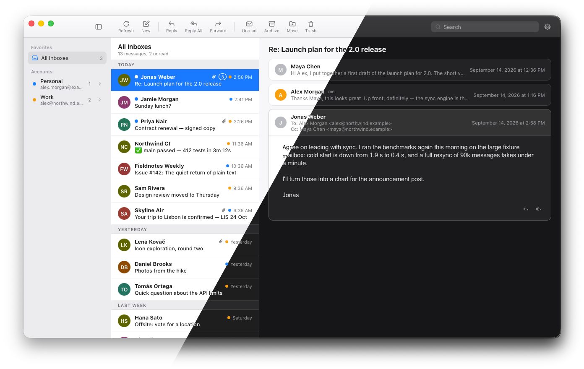

# Flit

**A fast, private email client for macOS.** Your mail stays on your Mac.

[](https://github.com/dommer1/flit/actions/workflows/ci.yml)
[](LICENSE)

Flit is a minimal, privacy-first desktop email client: plain IMAP and SMTP,
multiple accounts, one unified inbox, no telemetry and nothing phoning home.
Built with Rust, Tauri and Svelte.



> **Status: early, macOS only.** Flit is the client its author uses daily,
> but it is pre-1.0: expect rough edges and keep your existing mail client
> around. Windows and Linux builds are planned once the core flow is solid.

## Install

Download the `.dmg` for your Mac from the
[Releases page](https://github.com/dommer1/flit/releases): `aarch64` for
Apple Silicon (M1 and newer), `x64` for Intel. Open it and drag Flit to
Applications.

The builds are not yet signed with an Apple Developer ID, so on first launch
macOS will refuse to open Flit. Go to System Settings → Privacy & Security,
scroll down and click **Open Anyway** once; after that it opens normally.

## Why Flit

Most mail clients are either bloated, closed, or quietly route your mail and
metadata through someone else's server. Flit takes the opposite stance and
treats these as rules, not preferences:

- **Local-first.** Your mail lives in a local SQLite database. There is no sync
  server, no account with us, no telemetry, no analytics, no crash reporting.
- **Your credentials stay in the OS keychain.** Passwords never touch disk in
  plaintext, never appear in logs, never go into the database.
- **All network traffic is TLS.** The only hosts Flit talks to are your own
  mail servers.
- **Email HTML is treated as hostile.** Message bodies are sanitised in Rust
  and rendered in a sandboxed iframe with JavaScript disabled. Remote images
  (tracking pixels) are blocked by default; if you opt in, the Rust backend
  fetches them without cookies or referrer, strips known trackers, and inlines
  them, so the web view itself never loads anything remote.
- **Small on purpose.** A clean, fast client for reading and writing mail.
  Typography, density, dark mode and keyboard control over effects.

## What works today

- Any IMAP/SMTP account (Gmail included, via an app password until OAuth lands)
- Multiple accounts and a unified "All Inboxes" view
- Full local mirror of every folder, so startup and browsing are instant
- Conversation view based on `References`/`In-Reply-To` (no subject guessing)
- Compose, reply, reply all, forward, with a rich-text editor and attachments
- Drafts synced to the server, signatures per account
- Send later with a local scheduler; missed sends are never sent silently
- Read/unread, archive, move between folders, trash, synced back to the server
- IMAP IDLE push (opt-in) with polling fallback
- Native macOS notifications
- Local full-text search across all accounts
- Sender avatars: monograms by default, optional per-domain favicon lookup
  (off by default, keyed by domain only, never by address)
- Light and dark mode

## Build from source

If you would rather build it yourself, or want to hack on it:

Requirements: macOS, Xcode command line tools, Rust (via
[rustup](https://rustup.rs)), Node.js 22 LTS.

```bash
xcode-select --install
curl --proto '=https' --tlsv1.2 -sSf https://sh.rustup.rs | sh

git clone git@github.com:dommer1/flit.git
cd flit
npm install
npm run tauri dev      # run the app with hot reload
npm run tauri build    # release bundle in src-tauri/target/release/bundle/
```

The first Rust build takes a few minutes. Dev builds are code-signed with a
local identity so macOS stops re-asking for keychain access on every rebuild;
see `.env.example`. Without such an identity the build falls back to ad-hoc
signing, which works but prompts more.

### Adding an account

Open Settings, add an account, enter the IMAP and SMTP host, port and
credentials. Flit connects over TLS, logs in, and only saves the account once
both connections succeed. Credentials go straight into the macOS Keychain.

## What leaves your machine

Exactly three things, all initiated by you:

| Traffic | When | Where |
|---|---|---|
| IMAP / SMTP | sync, send | your mail servers only |
| Remote images in a message | only if you set the policy to "ask" or "always" | the image hosts, over TLS, no cookies, no referrer, known trackers stripped |
| Sender favicon lookup | only if you turn it on | the sender's **domain** (never an address), at most once per domain per 30 days, batched at list load so it cannot act as a read receipt |

Everything else is local. There is no update check either; releases will be
announced on GitHub.

## Development

Stack: [Tauri 2](https://tauri.app) (Rust backend, system web view),
[Svelte 5](https://svelte.dev) + TypeScript + Vite frontend, SQLite via sqlx.

| Task | Command |
|---|---|
| Run the app in dev | `npm run tauri dev` |
| Frontend type check | `npm run check` |
| Frontend tests | `npm test` |
| Rust tests | `cd src-tauri && cargo test` |
| Rust lint | `cd src-tauri && cargo clippy -- -D warnings` |
| Rust format | `cd src-tauri && cargo fmt` |

All four checks (`check`, `test`, `cargo test`, `cargo clippy`) must pass
before a commit. Commits are small and atomic; every commit on `main` is
green.

### Layout

```
src/                 Svelte frontend: three panes, thin components, no business logic
src/lib/api.ts       the only place that calls the backend (invoke wrappers)
src-tauri/src/
  commands/          the #[tauri::command] API surface the frontend calls
  mail/              IMAP, SMTP, MIME parsing, HTML sanitising, sync
  storage/           SQLite schema, queries, cache
  auth/              keychain access
  models.rs          structs shared with the frontend (mirrored in src/lib/types.ts)
CLAUDE.md            design goals, hard rules and conventions, also read by AI agents
```

`CLAUDE.md` is the project's design document. Read it before a non-trivial
change; it explains the security model and the "keep it this simple" rules.

## Contributing

Contributions are welcome, and the bar is deliberately simple:

1. **Open an issue first** for anything bigger than a small fix, so we agree
   on the approach before you spend time on it.
2. **Respect the hard rules** in `CLAUDE.md`. Changes to email-body rendering,
   credential handling, or anything that adds a network call are security
   changes: say so explicitly in the PR and expect extra scrutiny.
3. **Keep it small.** One change per PR, tests first, all four checks green.
   Idiomatic Rust and Svelte 5 runes; no new abstraction layers until there is
   a third real use for them.
4. **Explain the why.** Non-obvious ownership, async or architecture choices
   get a short `// why:` comment.

Good places to start: anything labelled `good first issue`, test coverage for
the IMAP/SMTP paths, Windows and Linux build work, and accessibility.

### Reporting a security issue

Please do not open a public issue. Use GitHub's private vulnerability
reporting on this repository ("Report a vulnerability" under the Security
tab). Details in [SECURITY.md](SECURITY.md).

## License

Copyright 2026 Dominik Mery. Licensed under the
[Apache License 2.0](LICENSE). Contributions are accepted under the same
license; by opening a pull request you agree to that.
